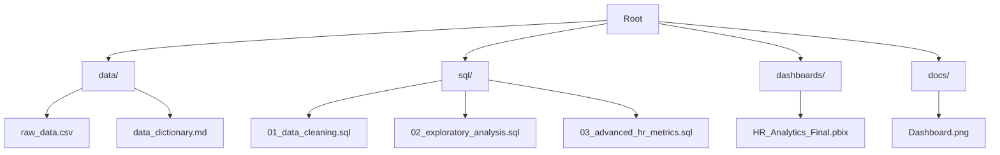
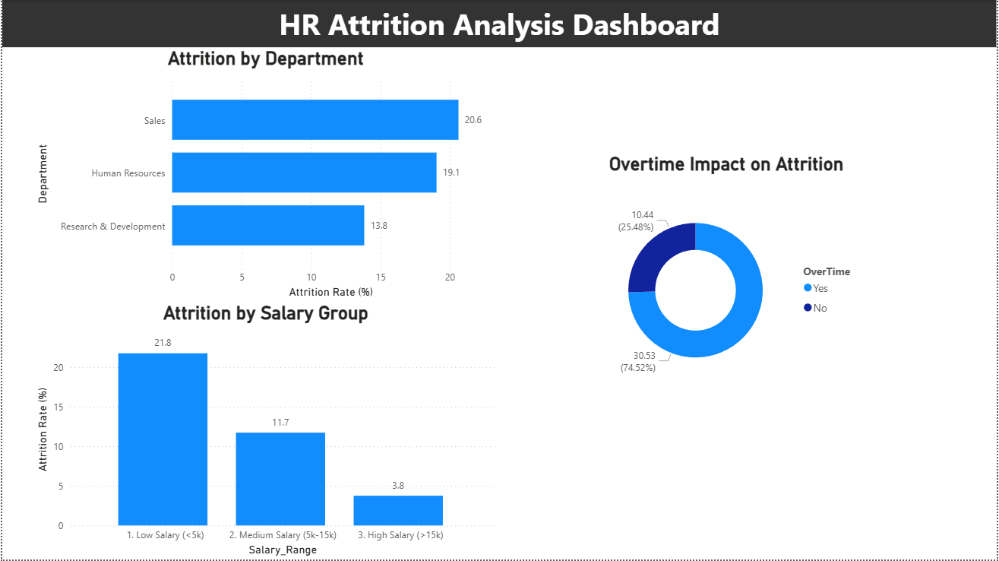

# 📊 HR Attrition & Retention Analytics
### *An Enterprise-Grade End-to-End Data Engineering & BI Pipeline*

---

**Empowering HR departments to transition from reactive reporting to proactive, data-driven retention strategies.**

[Explore SQL Pipeline](./sql) • [View Dashboard](./dashboards) • [Read Strategic Insights](#-strategic-business-insights)

## 📌 Project Overview

High employee turnover is a silent drain on corporate profitability, costing between **$50,000 and $150,000** per lost employee. This project develops a sophisticated analytical ecosystem—from raw data cleaning in SQL to interactive storytelling in Power BI—to identify and mitigate these risks.

---

## 🏗️ The Analytical Architecture

This pipeline follows a modern **ELT (Extract, Load, Transform)** workflow designed for scalability and performance.

### 🛠️ Tech Stack
- **Database Engine:** MySQL / PostgreSQL (High-performance analytical storage)
- **Data Engineering:** Advanced SQL (CTEs, Window Functions, Views)
- **Business Intelligence:** Power BI Desktop (Semantic modeling)
- **Data Modeling:** Star Schema (Optimized for cross-filtering)

---

## 📂 Repository Structure

---

## 💡 Strategic Business Insights

Based on deep-dive SQL analysis and interactive Power BI modeling, the following high-impact drivers were identified:

### ⛈️ The "Overtime Attrition" Correlation
*   **Metric:** Employees working overtime show a **30.53% attrition rate** vs. **10.44%** for others.
*   **Strategy:** Implement high-burnout role tracking and mandatory "wellness-cooldowns" for departments like Sales.

### 💵 Salary Sensitivity Analysis
*   **Metric:** Attrition in the 'Low Salary' bracket (<$5k) stands at **21.76%**.
*   **Strategy:** Perform a market-index salary adjustment to reduce replacement costs by an estimated **15% annually**.

### 📉 Progression Stagnation
*   **Metric:** Employees with 4+ years of tenure and NO promotions are at **highest risk**.
*   **Strategy:** Enforce a 2-year rotational skill-transfer program to maintain employee engagement.

---

## 💻 Technical Deep Dive

### 🔑 SQL Advanced Engineering
We utilize advanced syntax to build predictive indicators:
- **Window Functions:** `PERCENT_RANK()` to evaluate internal salary parity.
- **CTEs:** Multi-stage survival analysis based on tenure and promotion history.
- **Predictive Views:** `v_High_Flight_Risk_Employees` to flag individuals based on compounding factors.

### 📊 Power BI & DAX Mastery
- **Star Schema:** Denormalized fact table linked to optimized dimensions.
- **Complex DAX:** 
    - `YTD Attrition Rate`
    - `Rolling 3-Month Turnover Average`
    - `What-If Scenarios` for salary-based retention modeling.

---

## 📸 Dashboard Preview

---

## 🚀 Getting Started

1.  **Clone the Repo:** `git clone https://github.com/palurvashi2004-rgb/HR-Analytics-Dashboard.git`
2.  **Run SQL Scripts:** Execute `sql/01`, `02`, and `03` in order to build your analytical environment.
3.  **Open Dashboard:** Load `dashboards/HR_Analytics_Final.pbix` and update the Data Source Settings to your local SQL instance.

---

Developed with ❤️ for Data Excellence by <b>Urvashi</b>

